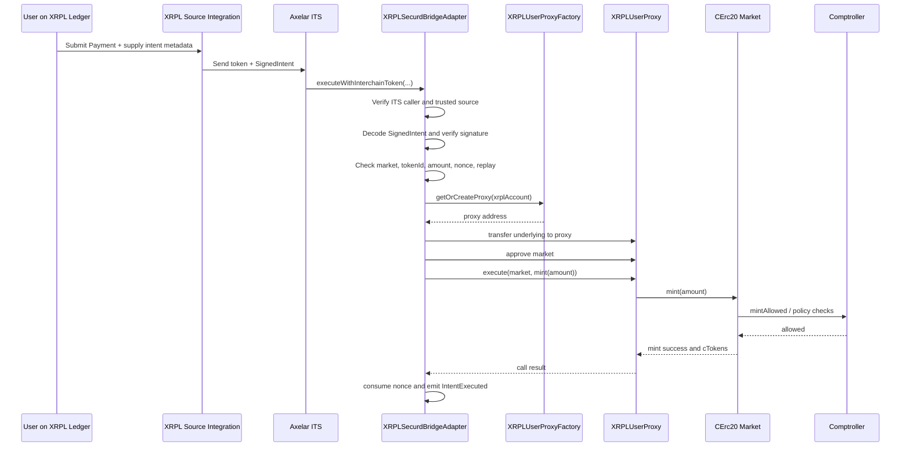
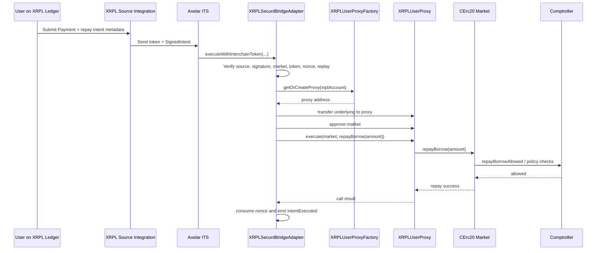
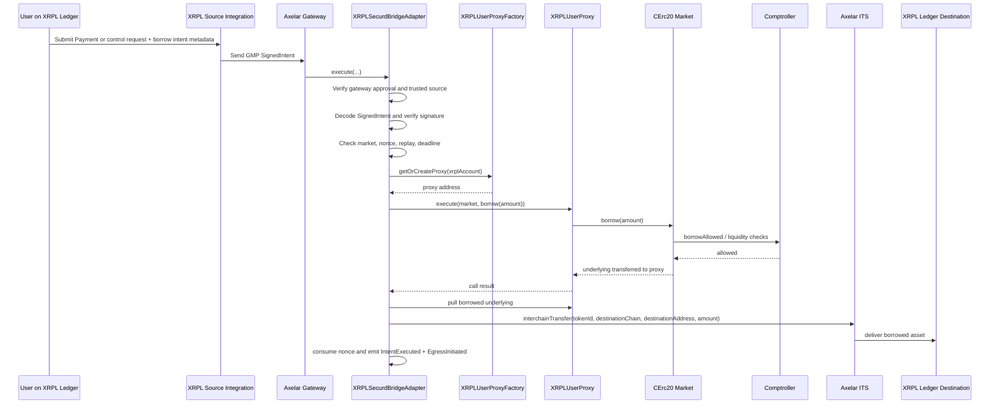
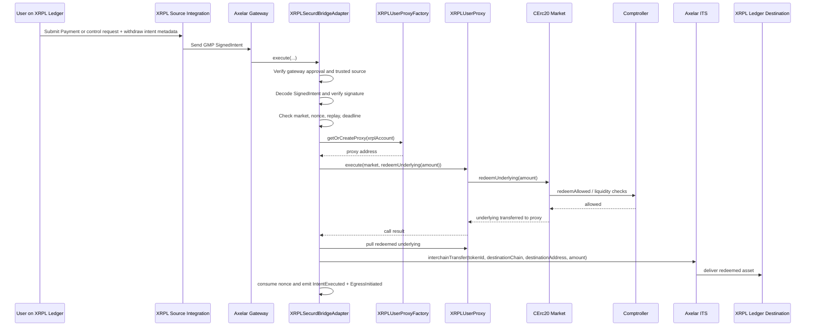
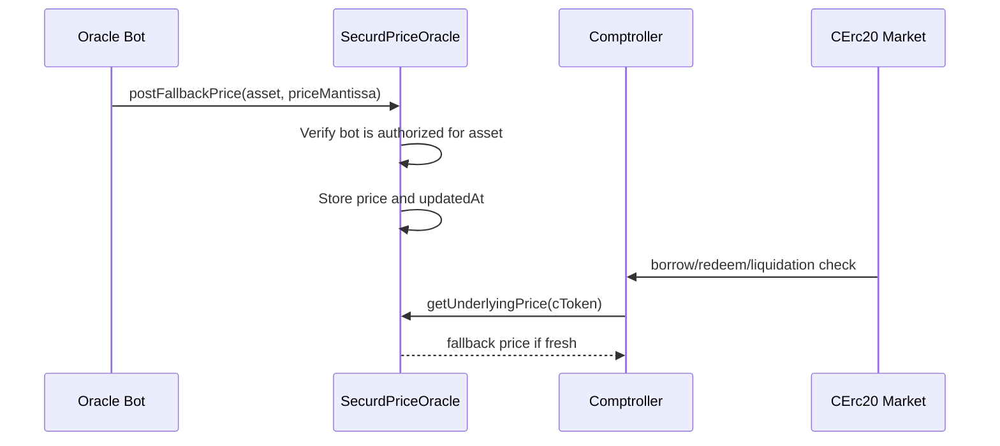

# Securd Sequence Diagrams

## 1. Purpose

This document adds sequence diagrams for the main user paths so engineers, auditors, and operators can quickly understand the runtime interactions.

## 2. Supply sequence

## 3. Repay sequence

## 4. Borrow sequence

## 5. Withdraw sequence

## 6. Oracle fallback update sequence

## 7. Notes

- `SUPPLY` and `REPAY` are value-bearing ingress actions.
- `BORROW` and `WITHDRAW` are control ingress actions with token egress.
- The bridge adapter is the only contract allowed to orchestrate the user proxy.
- cTokens stay on XRPL EVM and are not returned to XRPL Ledger.
